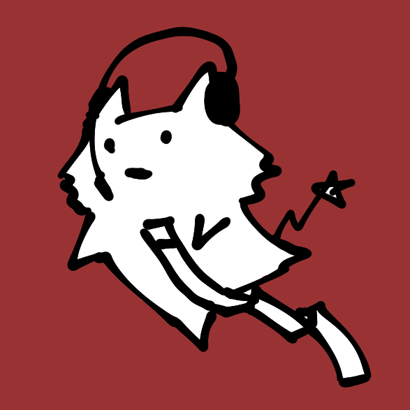

# Look at Me, I'm sakots-chan

Hi, I'm sakots. I'm enjoying my own schizophrenia.

by [github-readme-stats](https://github.com/anuraghazra/github-readme-stats)

## Currently working on

- [noReita](https://github.com/sakots/noReita) : An oekaki BBS script I worked hard on myself. SQLite and BladeOne is used.

## To do (if possible)

- A new oekaki BBS script.
- Or incorporate PaintBBS_NEO and Shi-Painter into Preroma, Mastodon, Misskey, etc.

## How to reach me

### Something like Twitter

- Twitter [@sakots696](https://twitter.com/sakots696)
  - I usually write in a language very similar to Japanese.
- Pawoo [@sakots@pawoo.net](https://pawoo.net/web/accounts/61687)
  - I don't usually see much.

### 📫 email

sakots8000@gmail.com

- I don't know if it's classified as junk mail.

## Hi there 👋

OK, Let's hear the matter...

<!--
**sakots/sakots** is a ✨ _special_ ✨ repository because its `README.md` (this file) appears on your GitHub profile.

Here are some ideas to get you started:

- 🔭 I’m currently working on ...
- 🌱 I’m currently learning ...
- 👯 I’m looking to collaborate on ...
- 🤔 I’m looking for help with ...
- 💬 Ask me about ...
- 📫 How to reach me: ...
- 😄 Pronouns: ...
- ⚡ Fun fact: ...
-->
